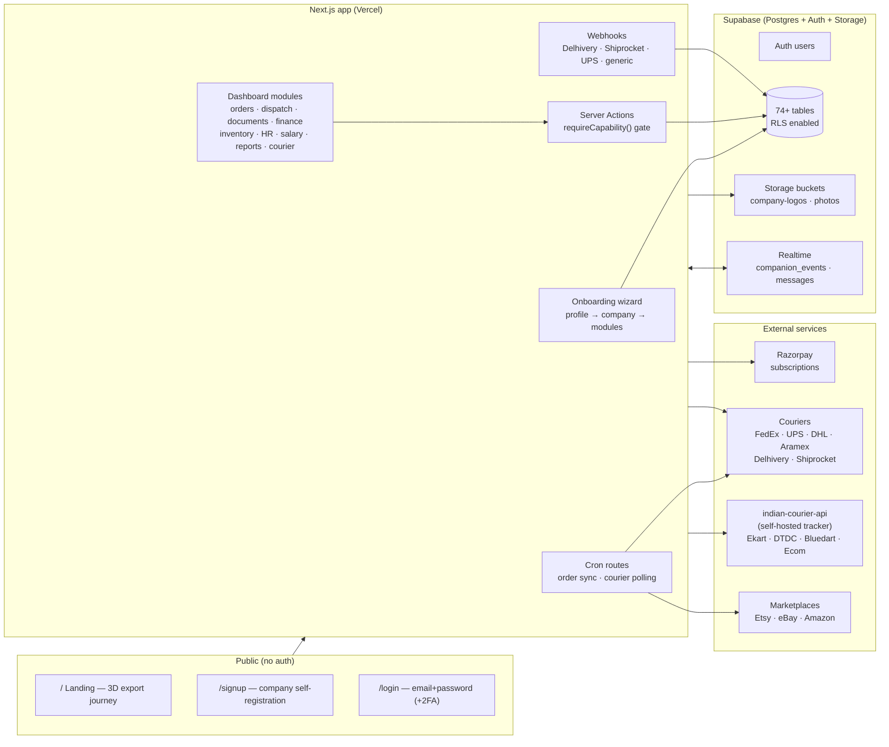
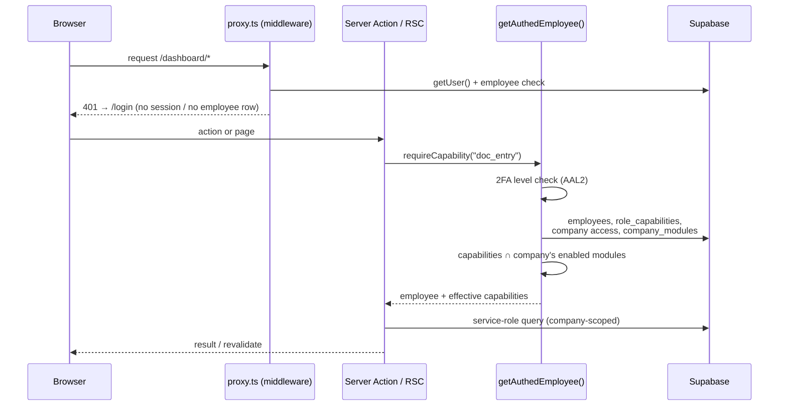
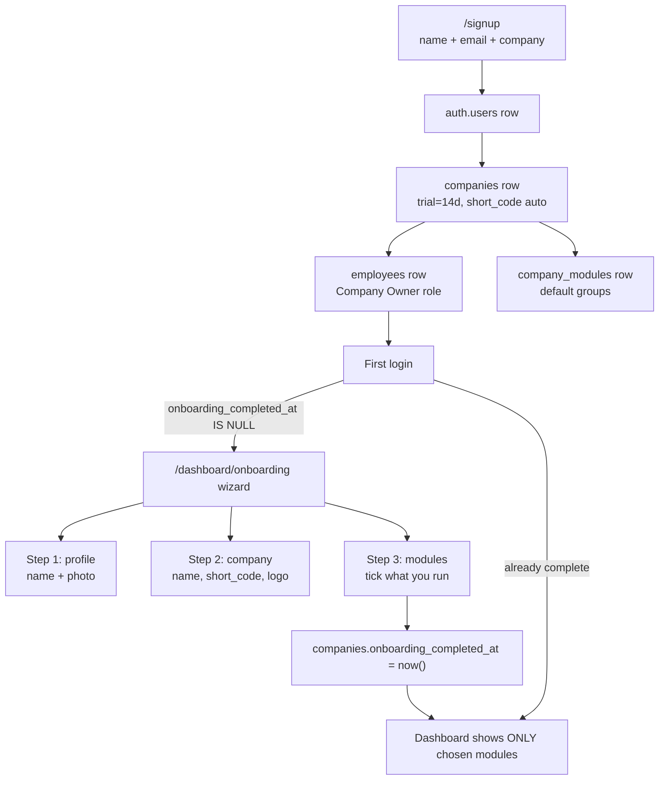
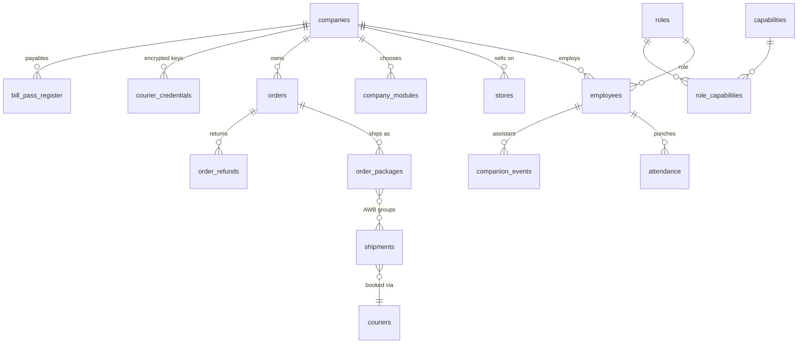
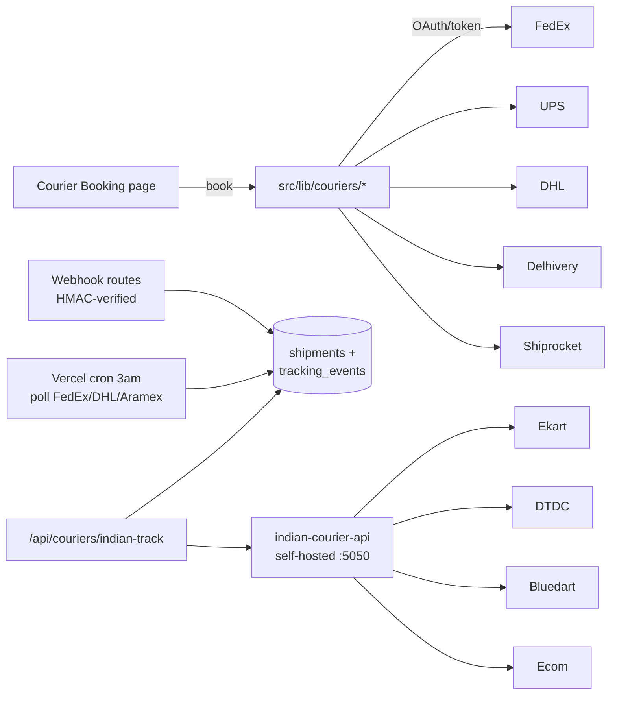
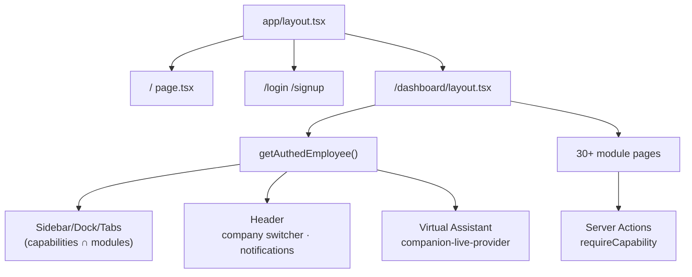

# OMS Pro — System Architecture

> Complete architecture reference for the OMS Pro multi-tenant Order
> Management System. Diagrams are [Mermaid](https://mermaid.js.org/) — they
> render on GitHub. Companion docs: `README.md` (business rules),
> `db/schema.sql` (the database itself, 74+ tables, numbered sections),
> `BRAIN.md` (decision log).

---

## 1. The big picture

OMS Pro is a **single Next.js app + one Postgres (Supabase) database**,
multi-tenant by design: every company that signs up gets its own workspace
(own logo, own document numbering, own module selection) inside one shared
database, isolated by Row Level Security + server-side company scoping.



---

## 2. Request lifecycle & the security spine

Every privileged read/write passes through **one choke point**:
`getAuthedEmployee()` in `src/lib/auth/require-capability.ts`.



Guarantees:

1. **Role capabilities** — what the employee's role grants (`role_capabilities`).
2. **Company module selection** — what the company switched on during
   onboarding (`company_modules.enabled_groups`). The effective capability
   list is the **intersection**, applied inside `getAuthedEmployee()` — so a
   company that turned HR off has no HR tiles *and* its HR actions are
   rejected server-side.
3. **RLS** — every table denies `anon`; the anon key alone reads nothing.
4. **Service-role only in actions** — after identity + capability are proven.

---

## 3. Multi-tenancy & onboarding



- **Old companies** (pre-wizard) are stamped complete by the migration —
  nothing changes for them until they opt in.
- **Module groups** (`src/lib/company-modules.ts`): orders, dispatch,
  documents, finance, inventory, hr, salary, reports, crm, courier,
  marketing, admin. DB stores group ids; the app expands them to capability
  codes, so adding a page to a group never needs a migration.
- **Re-branding**: logo uploads go to the public `company-logos` bucket;
  `companies.logo_url` feeds the dashboard header, printed invoices, and the
  small "Powered by OMS Pro" export watermark.

---

## 4. Data model (core slice)



- `db/schema.sql` is the single source of truth — numbered sections, 74+
  tables, triggers for document numbering (`reserve_next_number`), views for
  reconciliation (freight/duty variance).
- Migrations are dated SQL files in `db/` — additive, idempotent.

---

## 5. Courier & tracking integrations

Two complementary families:

| Family | Couriers | Direction | Where |
|---|---|---|---|
| Direct APIs | FedEx, UPS, DHL, Aramex, Delhivery, Shiprocket, Shipglobal | Booking (create label/AWB) + webhooks + polling crons | `src/lib/couriers/*-ship.ts`, `src/app/api/webhooks/courier/*`, `vercel.json` crons |
| indian-courier-api | Ekart, Ecom, DTDC, Bluedart, Shadowfax, Gati, Maruti (+DHL) | Tracking-only, via self-hosted service | `src/lib/couriers/indian-courier-tracking.ts` + `/api/couriers/indian-track` |



**indian-courier-api setup** (user task, one-time):
```bash
git clone https://github.com/rajatdhoot123/indian-courier-api
cd indian-courier-api && npm install && npm start   # :5050
# deploy anywhere reachable, then set env var on the OMS Pro project:
#   INDIAN_COURIER_API_BASE=https://your-tracker.example.com
```

---

## 6. The AI-operated layer

OMS Pro is increasingly **AI-operated**: software that notices, narrates,
and celebrates instead of waiting to be asked.

| Signal | Automated reaction |
|---|---|
| Birthday / work anniversary | Virtual Assistant dances on every dashboard + banner; company-wide |
| New employee ID created | DB trigger queues a welcome dance — "ab to party to banti hai" |
| Data saved (invoice, credit/debit note, purchase bill) | Assistant pops with a celebratory nod |
| Error logged (booking failure, validation) | Assistant concerned + Error Tab entry for Admin/MD |
| Trial ending / plan limits | Billing nudges + Enterprise upsell path |
| Order sync (Etsy/eBay/Amazon) | Nightly cron imports, dedupes, attributes to a System employee |

The Virtual Assistant itself: photo-first portrait (user-supplied look),
daily outfit + makeup rotation (pure function of date — no scheduler),
state-driven animations (punch-in, focused, dance, concerned), realtime
events via Supabase `postgres_changes` on `companion_events`.

**Open Code Review** (github.com/alibaba/open-code-review) is the
recommended CI reviewer for this repo — deterministic diff selection +
LLM line-level comments. Suggested wiring:

```yaml
# .github/workflows — user task (needs an LLM API key):
#   npm i -g @alibaba-group/open-code-review
#   ocr config provider   # one-time
#   ocr review --from main --to feature-branch --format json
```

Run it locally against a branch before requesting review; CI integration is
documented in their docs and left as a deliberate user step (needs their
model key).

---

## 7. Frontend architecture

- **App Router** (Next.js 16), Server Components by default; `"use client"`
  only for interactive islands (wizard, sidebar, assistant, 3D scenes).
- **Theming**: 7 dashboard themes + custom accent per employee
  (`employees.theme_id`, `custom_accent_color`) via CSS variables; all
  public pages are dark-first (`slate-950`) so every font stays readable —
  the "every font showing dark according to theme" rule.
- **Navigation**: Work Menu sidebar ⇄ bottom Dock ⇄ browser-style workspace
  tabs — all capability-filtered, now also module-filtered.
- **3D**: plain `three.js` (no react-three-fiber) with two failure layers —
  try/catch around setup + render loop, React error boundary in the parent —
  so a WebGL glitch can never break a page.
- **Animation bits** (`src/components/landing/animated-bits.tsx`):
  SplitText, Reveal, CountUp, Marquee — react-bits-style, dependency-free,
  honoring `prefers-reduced-motion`.



---

## 8. Environments & deployment

- **Vercel** (Next.js defaults) + **Supabase** project (Postgres/Auth/
  Storage/Realtime).
- Env vars: `NEXT_PUBLIC_SUPABASE_URL/ANON_KEY`, `SUPABASE_SERVICE_ROLE_KEY`,
  `ENCRYPTION_KEY` (AES-256-GCM for stored courier/marketplace keys),
  `CRON_SECRET`, per-courier API keys, `INDIAN_COURIER_API_BASE`.
- Crons: `/api/cron/sync-orders` (2am), `/api/cron/poll-fedex-tracking`
  (3am, also DHL/Aramex).
- Deploys: push to `main` → Vercel build. SQL migrations run manually in
  Supabase SQL Editor (additive, idempotent).

---

## 9. Where to add what

| Task | File(s) |
|---|---|
| New module group / toggle | `src/lib/company-modules.ts` (+ wizard reads it automatically) |
| New dashboard capability | `db/schema.sql` seed + `src/lib/capability-info.ts` |
| New courier | `src/lib/couriers/<name>-*.ts` + `credentials.ts` field defs |
| New landing animation | `src/components/landing/animated-bits.tsx` |
| New celebration trigger | `src/lib/companion/celebrate.ts` + event type in `companion-config.ts` |
| New table | `db/2026-MM-DD-*.sql` (additive, idempotent) + regenerate types |
